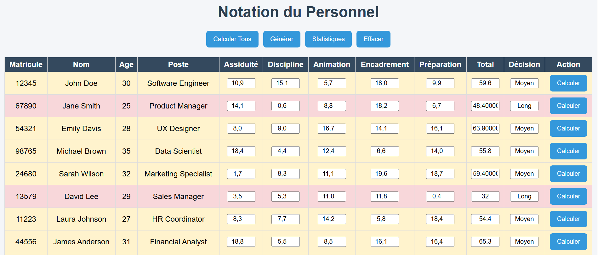

# Personnel Evaluation System

This project is a simple personnel evaluation and management system built with HTML, CSS, and JavaScript.  
It allows managers to evaluate employees based on different criteria and automatically generate statistics and decisions.

---

## Project Structure

- **Frontend (HTML/CSS/JavaScript)**: User interface and application logic.
  - `Notation_Personnel.html`: Main application page
  - `style.css`: Application styling and responsive design
  - `Personnel.js`: Personnel data source
  - `screenshots/`: Application screenshots used in the README

---

## Features

### Personnel Evaluation Table

- Dynamic personnel display
- Employee evaluation system
- Automatic total calculation
- Decision generation based on scores



---

### Statistics Dashboard

- Rapid evaluation statistics
- Medium evaluation statistics
- Long evaluation statistics


---

## Technologies Used

- HTML5
- CSS3
- JavaScript (Vanilla)

---

## Setup Instructions

1. Download or clone the project
2. Open the following file in your browser:

```bash
Notation_Personnel.html
